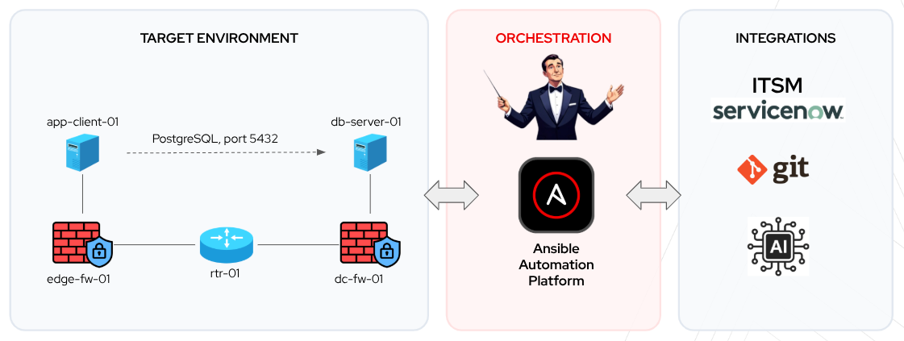
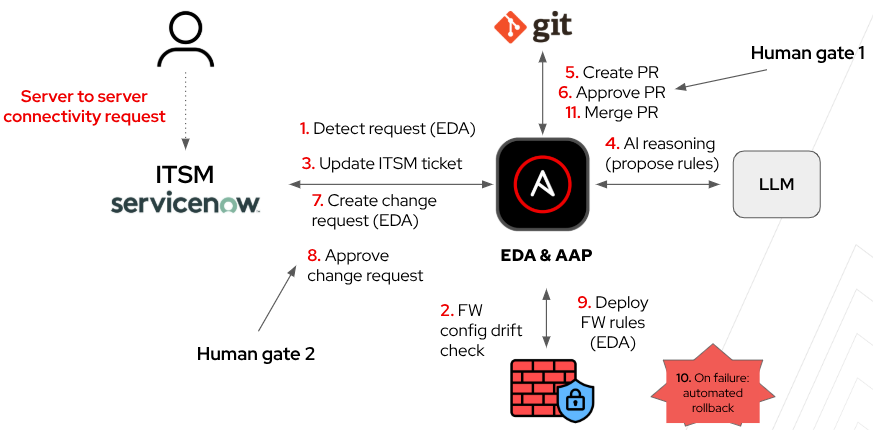

# AIOps-Driven Firewall Change Orchestration with Ansible Automation Platform

This project demonstrates how Ansible Automation Platform orchestrates ITSM, AI, and network infrastructure in a single event-driven workflow based on GitOps principles.

Palo Alto firewall automation serves as the example here, but the same architectural pattern can also be applied to other use cases, including compliance remediation, access management and broader network automation scenarios beyond firewall changes.

The orchestrated workflow includes:

* **Cross-domain orchestration:** ServiceNow, Git, AI, and Palo Alto firewalls connected in a single workflow
* **Event-driven automation:** Automatic responses to infrastructure events
* **AI under control:** The LLM performs the analysis, while AAP executes changes in a deterministic and secure way
* **GitOps for infrastructure:** Declarative configuration, version control, automation, and configuration drift management

## High-Level Architecture

## Configuration as Code

The intended configuration of the Palo Alto firewalls is defined as structured data in the `host_vars` directory, following the Configuration as Code approach.

Before applying any changes, AAP compares the live firewall configuration with the intended state in Git to detect configuration drift.

## Event-Driven Workflow

In this project, Event-Driven Ansible automatically responds to three key events:

1. **A ServiceNow request is submitted**:
   AAP gathers the current configuration state, the AI analyzes the request, and AAP opens a pull request with the proposed change.

2. **The pull request is approved**:
   AAP creates the corresponding change record in ServiceNow.

3. **CAB approval is received**:
   AAP deploys and validates the change, using AI-assisted analysis where required, and then updates both Git and ServiceNow.

## How AI Is Used in This Scenario

AI supports the workflow by analyzing requests, proposing firewall rules, and preparing information for human review by enriching ServiceNow tickets, change records and pull requests. AI does not deploy changes. AAP executes the approved changes only after the required approval gates.

### 1. Proposes Firewall Rules

The AI traces the traffic path across firewalls, identifies the relevant security zones, and returns the proposed firewall rules as structured data that Ansible can process.

### 2. Prepares the Pull Request

**Human gate 1: pull request review**

The AI enriches the pull request with the traffic-path analysis and a clear rationale for the proposed change. A human reviewer must approve the pull request before the workflow continues.

### 3. Drafts the Change Record

**Human gate 2: change approval**

The AI prepares the ServiceNow change record by summarizing the scope, risk, impact, and rollback plan for CAB review.

### 4. Updates the Request

When no change is required, the AI explains the outcome. For example because the traffic is already allowed, the request conflicts with an existing policy, firewall application ID is not defined or the network topology cannot be determined. AAP posts this information to the ServiceNow RITM.

## AAP Orchestration Workflow

## Demo Lab Topology

The demo lab is built using [Containerlab](https://containerlab.dev) and includes:

* Two Palo Alto Networks VM-Series firewalls
* One Arista cEOS router
* Two Linux containers representing an application and a database server

The Containerlab topology definition and related files are available in the `topology` directory.

### Baseline Firewall Configuration

The lab is intentionally configured to block traffic from `app-client-01` to `db-server-01` on TCP port `5432`.

The initial security policies:

* `edge-fw-01`
  * `ALLOW-APP-TO-CORE-DNS-CHG0001` - legacy rule matching the APP to CORE zone pair but pointing at an unreachable destination, so it must not be mistaken for existing coverage
  * `ALLOW-APP-TO-CORE-POSTGRES-CHG0002` - allows PostgreSQL traffic from `10.10.10.0/24` to `10.20.20.0/24`
  * `DENY-ANY-ANY`
* `dc-fw-01`
  * `DENY-ANY-ANY`

The existing rules are intentional. The AI must analyze the current configuration and determine where a new rule is actually required.

## Demo Use Cases

### Use Case 1

The user submits a ServiceNow request to allow PostgreSQL traffic:

`10.10.10.5/32 → 10.20.20.5/32` on TCP port `5432`

The expected result is:

1. `edge-fw-01` is the first firewall on the path, with traffic flowing from the **APP** zone to the **CORE** zone.
2. Its existing PostgreSQL rule already permits traffic from `10.10.10.0/24` to `10.20.20.0/24`, so no change is required on this firewall.
3. On `dc-fw-01`, traffic flows from **CORE** to **DB**, but no existing rule permits it.

The workflow should therefore propose a single new rule on `dc-fw-01`.

Creating another rule on `edge-fw-01` would be redundant. The AI must recognize that the requested `/32` addresses are already covered by the broader `/24` rule.

### Use Case 2

The user submits a ServiceNow request to allow SSH traffic:

`10.10.10.5/32 → 10.20.20.5/32` on TCP port `22`

No existing rule permits this traffic. The workflow should therefore propose new SSH rules on both `edge-fw-01` and `dc-fw-01`.

### Use Case 3

The user submits a ServiceNow request to allow traffic on a port for which no Palo Alto Networks application ID is defined:

`10.10.10.5/32 → 10.20.20.5/32` on TCP port `48620`

The workflow should stop without proposing or deploying any firewall rules.

The LLM should generate a ServiceNow work note explaining that no matching application ID was found and that an engineer must define it manually before the request can proceed.

## Author
[Michal Zdyb](https://www.linkedin.com/in/michal-zdyb-9aa4046/)